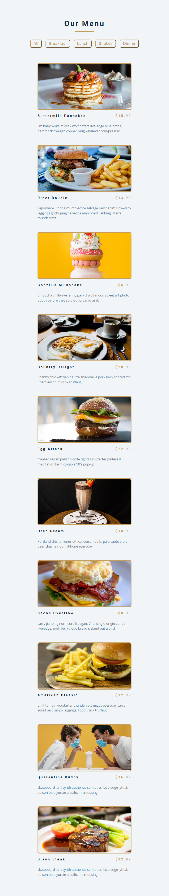
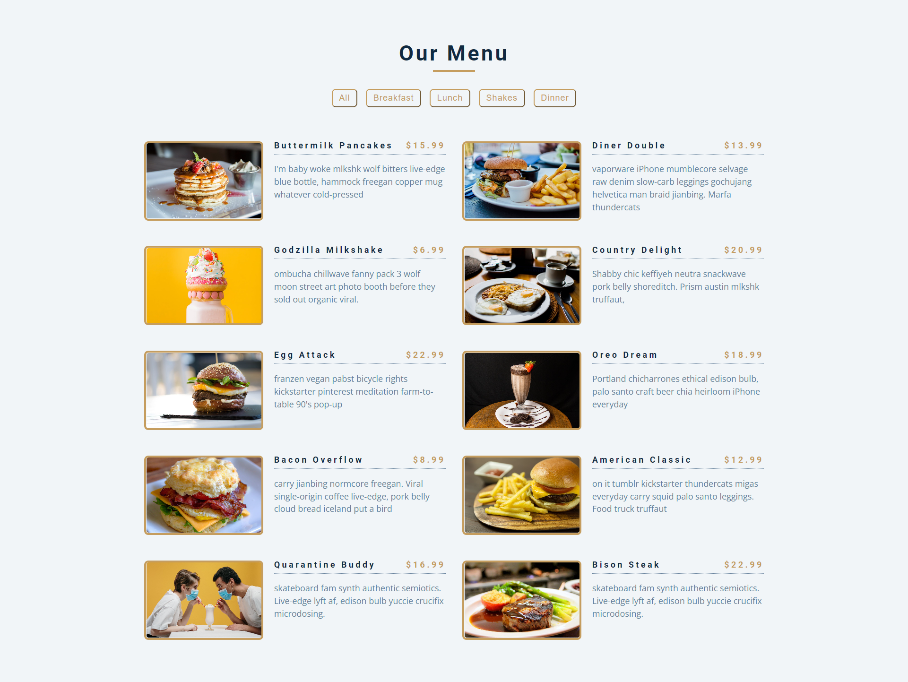

# Menu List item 

## Table of contents

- [Overview](#overview)
  - [Screenshot](#screenshot)
  - [Links](#links)
- [My process](#my-process)
  - [Built with](#built-with)
  - [What I learned](#what-i-learned)
- [Author](#author)

## Overview

### Screenshot

### Links

- Live Site URL: [Link to live site](https://z3shan7.github.io/Menu-food-list/)

## My process

- i learned how Array methods work
- where to use it 
- how to use it

### Built with

- Semantic HTML5 markup
- CSS custom properties
- Flexbox
- CSS Grid
- Mobile-first workflow
- SCSS
- BEM
- local Data
- Advance Array methods

### What I learned

I got the idea of how to work with Api's how to add elements dynamically in javascript

- Flexbox is definitely more complicated than I thought, and I need more time to figure how to make it work. I don't want to just give up on the idea of using it, but I do need some more learning. 

- I initially wrote a switch in the JS for going between the three different states, which worked well, but I felt I could simplify the code even further because I didn't want repetition. I first tried going in the direction of using `Object(keys)` but in the end I realized that things are actually a lot more simpler, and all it took was just one line of deconstruction.

Overall, the JS was probably the easiest part of the project; the biggest challenge for me was figuring out widths in flexbox, especially when there are nested flex components. I ended up using grid in the end for the cards, and I feel I need a refresher on both flexbox and grid, as well as some deeper understanding in the more advanced concepts.

## Author

- Frontend Mentor - [@z3shan7](https://www.frontendmentor.io/profile/z3shan7)

